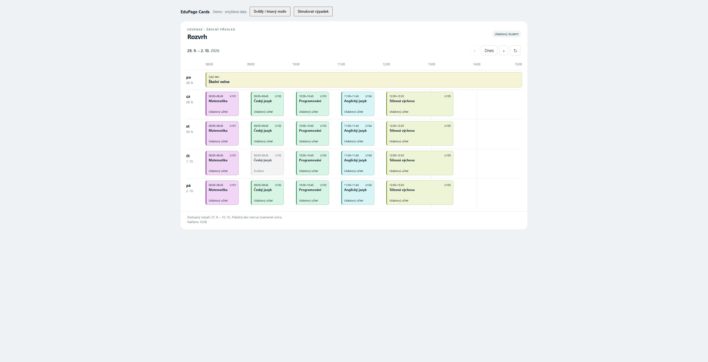

# EduPage Cards for Home Assistant

Timetable, school messages and grades for a family Home Assistant dashboard. All three cards include Czech and English text, a visual editor, theme support and a shared student selector. They use data already available in Home Assistant without requiring EduPage credentials in the cards.



## Status

Version 0.3.0 includes three cards, verified in Home Assistant on desktop and mobile layouts. Install through HACS as a custom repository; inclusion in the default HACS catalog is pending.

## Cards

| Card | Purpose |
| --- | --- |
| `custom:edupage-timetable-card` | Weekly timetable or daily list, lesson details and subject colors |
| `custom:edupage-messages-card` | Recent school messages with full available text in a dialog |
| `custom:edupage-grades-card` | Latest assessments or grades grouped by subject, with a detail dialog |

Use one card with multiple students, or a separate dashboard section for each child. See [the family layout example](#family-dashboard).

## Timetable features

- Weekdays in rows with a real-time horizontal axis; optional weekends.
- Stable subject colors, teacher and classroom details.
- Multi-period events keep their actual duration; adjacent events are not merged.
- Full-width holidays, cancelled lessons, and overlapping events in separate lanes.
- Student and week selection, current-lesson highlighting, and lesson details.
- Czech and English text, Home Assistant theme support, and a mobile daily view.
- Error/retry state and a notice for dates outside the configured data window.

## Requirements and limitations

Install [EduPage for Home Assistant](https://github.com/rine77/homeassistantedupage) and configure the students there. The timetable uses its calendar entities; messages require notification sensors with an `events` attribute; grades use per-subject sensors with `grade_*` attributes. Entity IDs vary by installation—select your own entities in the visual editor. The cards use HA authentication and do not log in to EduPage.

The integration currently caches today and the following 13 days. The card defaults to this same window and does not interpret empty responses as confirmed days off. `available_days` changes the card's allowed window only; it does not make the integration fetch more data. Past dates are not supported by this version. On weekends, the card initially opens the following week.

The current calendar does not expose lesson numbers, school-defined colors, groups, or detailed substitution metadata. This version uses actual lesson times and card-assigned colors. `[Canceled]` events are shown as cancelled. All-day calendar dates and the integration's 00:00–23:59 holidays are supported. Named events require the integration to provide their title.

A visual editor is available in Home Assistant: edit the dashboard, then edit this card. Configure students and their order, names, title visibility, student visibility, weekends, language, subject colors and the available date range. Changes appear in the preview before saving. YAML remains available for all options, including `subject_labels`. Calendar data refreshes on entity changes, every five minutes, or via the refresh button. The refresh button rereads HA's cache; it does not force a new EduPage poll.

## Install with HACS

1. In HACS, open the menu and choose **Custom repositories**.
2. Add `https://github.com/rkotulan/ha-edupage-cards` with type **Dashboard**.
3. Find **EduPage Cards**, download it, and reload your browser.
4. If the resource was not added automatically, add `/hacsfiles/ha-edupage-cards/edupage-cards.js` as a JavaScript module in dashboard resources.
5. Add **EduPage Timetable**, **EduPage Messages** or **EduPage Grades** through the card picker and configure it in the visual editor. YAML examples are below.

Do not load both a manually installed copy and the HACS resource.

## Build and install manually

Requires Node.js 22.12+ and npm.

```sh
npm ci
npm run type-check
npm test
npm run build
```

Copy `dist/edupage-cards.js` to `/config/www/edupage-cards/edupage-cards.js` on Home Assistant. In dashboard resources, add `/local/edupage-cards/edupage-cards.js?v=0.3.0` as a JavaScript module. Reload the browser after installation; change the query version when replacing the file.

Add a manual card:

```yaml
type: custom:edupage-timetable-card
title: Školní rozvrh
language: cs
students:
  - entity: calendar.edupage_student_one
    name: Student 1
  - entity: calendar.edupage_student_two
    name: Student 2
```

For a single calendar, use `entity: calendar.edupage_student` instead of `students`. For the weekly layout, use a panel view or a full-width section card; below 680 px card width, the daily layout is used.

| Option | Default | Meaning |
| --- | --- | --- |
| `entity` | — | One timetable calendar; required unless `students` is supplied |
| `students` | — | List of `{ entity, name? }`; takes precedence over `entity` |
| `title` | Localized “Timetable” | Optional card heading, visible when `show_title` is enabled |
| `show_title` | `false` | Show the card heading above navigation |
| `show_student` | `true` | Show the student name/avatar or student picker. When hidden, the card uses the first configured student (or `entity`). |
| `language` | HA language | `cs` or `en`; other HA languages fall back to English |
| `show_weekend` | `false` | Include Saturday and Sunday |
| `available_days` | `14` | Available days starting today, matching the integration's cache |
| `subject_labels` | `{}` | Map full subject names to shorter labels; detail retains the full title |
| `subject_colors` | `{}` | Map full subject names to quoted `#RGB` or `#RRGGBB` background colors |

For example, add this to the card configuration:

```yaml
subject_colors:
  Matematika: "#90caf9"
  Český jazyk: "#a5d6a7"
  Anglický jazyk: "#ffe082"
```

Names match the original full subject title (with surrounding whitespace ignored), not `subject_labels`. The mapping applies to all configured students. Subjects without an override keep their automatic colors. Text switches between black and white for contrast; cancelled lessons retain their neutral appearance. Quote hex colors in YAML, otherwise `#` starts a comment. Colors can be configured in the visual editor or YAML. Use Automatic in the editor to remove an override.

## Messages card

`custom:edupage-messages-card` shows messages from EduPage notification sensors. It uses the structured `events` attribute and filters events with type `sprava`. The integration must expose this attribute; the card reports unsupported sensors instead of presenting them as an empty inbox.

```yaml
type: custom:edupage-messages-card
language: cs
students:
  - entity: sensor.edupage_notification_student_one
    name: Student one
  - entity: sensor.edupage_notification_student_two
    name: Student two
max_messages: 10
```

For a single student, use `entity` or a one-item `students` list. The visual editor supports notification sensors, student names/order, title, language, visibility and the message limit.

| Option | Default | Meaning |
| --- | --- | --- |
| `entity` / `students` | Required | Notification sensor or list of `{entity, name}` entries |
| `title` | Localized “School messages” | Card heading |
| `language` | HA language | `cs` or `en` |
| `show_student` | `true` | Show student identity/picker; when hidden, use the first student |
| `max_messages` | `10` | Show the newest 1–100 messages available in the sensor |

Open a message to read its full available text in a dialog (a bottom sheet on mobile). Close it with Escape, the close button or a click outside. All three cards use the same student selector with keyboard navigation. Content is displayed as plain text, never executed as HTML. Attachments, replies and EduPage read receipts are not supported. Viewing a message does not mark it as read in EduPage. Messages update when HA updates the sensor; the card does not trigger additional EduPage requests.

On desktop the message dialog is up to 760 px wide; on mobile it opens as a bottom sheet. The history notice appears in the small footer beside the read-state note.

The sensor can provide only part of the history. The card displays `events_truncated` and `data_stale` warnings, differentiates unavailable/unsupported sensors from an empty history, and does not claim to show all messages or an unread count. Timestamps without a timezone are displayed as supplied by the connector, without conversion to the browser timezone.

## Grades card

`custom:edupage-grades-card` reads the integration's per-subject grade sensors. It offers newest-first and subject-grouped views, the shared student picker, and a detail dialog with the assessment title, date, teacher, comment and optional percentage, maximum points and class average.

```yaml
type: custom:edupage-grades-card
students:
  - name: Student
    subjects:
      - entity: sensor.edupage_student_mathematics
        name: Mathematics
      - entity: sensor.edupage_student_english
        name: English
language: en
default_view: latest
```

The visual editor can discover students with available grades, rename/reorder/remove them and select subject sensors. `students` lists exact sensors to keep each student's data separate. Add newly available subjects in the editor; they are not silently added to existing configurations. Subject names may be overridden with `name`. Optional `title`, `show_student` (default true), `language` (HA default) and `default_view` (`latest` or `subjects`) control presentation. The first student is the default.

The card shows all assessments exposed by the selected sensors, not an unread count or a guarantee of complete school history. It preserves textual marks and displays unavailable, unsupported and stale data separately. Grade weights are not exposed by the connector, so no student average is calculated. A class average, when supplied, belongs to that individual assessment. No additional EduPage requests are made.

## Family dashboard

### Compact family overview (development)

The timetable, messages and grades cards accept `compact: true` (also available in their visual editors). Timetables use the daily view, messages use one-line previews, and grades show the three latest assessments. Full detail dialogs remain available. Informational footnotes collapse under **Information**, while unavailable and stale-data warnings stay visible.

For messages, set `max_messages: 2`. Messages and grades accept `more_path`, a local Home Assistant path to a full-list subview, for example `/school/messages-student`. Create that subview separately with `compact: false`; the link does not create a view or change the student automatically.

Use `custom:edupage-overview-card` at the top of each child's section for an initial avatar, latest attendance record and assignment summary. Its visual editor supports these settings:

```yaml
type: custom:edupage-overview-card
name: Student
accent: blue # blue, green or violet
notifications: sensor.student_notifications
open_homework: sensor.student_open_homework
overdue_homework: sensor.student_overdue_homework
upcoming_exams: sensor.student_upcoming_exams
next_deadline: sensor.student_next_homework_deadline
duties_path: /school/assignments-student
language: en
```

Choose the actual entities from your integration. Counts of zero are distinct from unavailable values. Attendance uses the newest `pipnutie` event, preserves arrivals and departures, and never claims current presence. Missing attendance records can mean incomplete history. Omit the grades card for schools without grades. The cards follow Home Assistant's theme; Sections stack each child's cards on mobile.

### Standard layout

Create a Sections view with one section per child. Give each card a single student and set `show_student: false` to avoid repeating a selector below the section heading. Sections appear side by side on wider screens and stack on mobile. A timetable inside a narrow section uses its daily layout. Omit the grades card for children whose school does not use grades.

This example is one section; duplicate it with different entities for other children:

```yaml
type: sections
title: School overview
path: school
max_columns: 3
sections:
  - type: grid
    cards:
      - type: heading
        heading: Student one
        heading_style: title
      - type: custom:edupage-timetable-card
        entity: calendar.edupage_student_one
        show_student: false
        show_title: true
        grid_options:
          columns: 12
          rows: auto
      - type: custom:edupage-messages-card
        entity: sensor.edupage_notification_student_one
        show_student: false
        max_messages: 3
        grid_options:
          columns: 12
          rows: auto
      - type: custom:edupage-grades-card
        show_student: false
        students:
          - name: Student one
            subjects:
              - entity: sensor.edupage_student_one_mathematics
                name: Mathematics
        grid_options:
          columns: 12
          rows: auto
```

## Notifications

The cards display data; they do not create notifications. Shared HA notifications for new school events can be configured separately with an automation using the integration's `homeassistantedupage_event` events and `persistent_notification.create`. This is optional and is not installed or enabled by this card release.

## Development

```sh
npm run dev
```

Open the local URL printed by Vite for a synthetic demo with light/dark theme and outage controls. It needs no HA credentials. Tests cover time zones and DST, date-only holidays, multi-day clipping, overlaps, invalid input, request races, unavailable calendars, grade/message parsing, student isolation and missing data.

Use synthetic fixtures only. Never commit actual school messages, student details, credentials, local deployment settings, or private attachments. See [the roadmap](docs/roadmap.md) for completed features and remaining work.

## License

MIT. This is an independent community project, not an official EduPage product.
